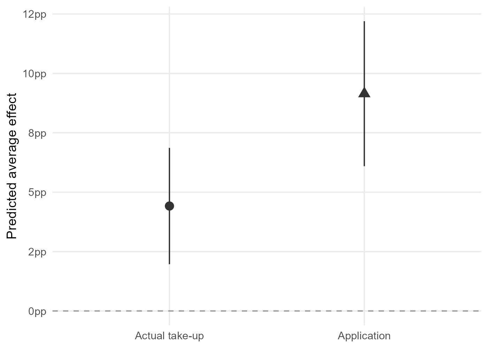
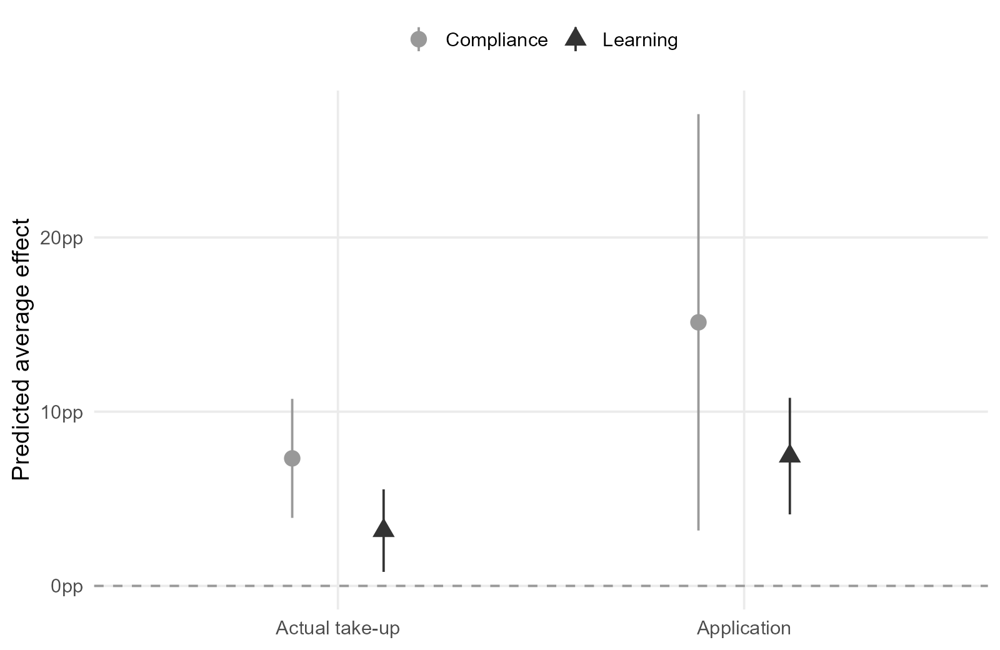
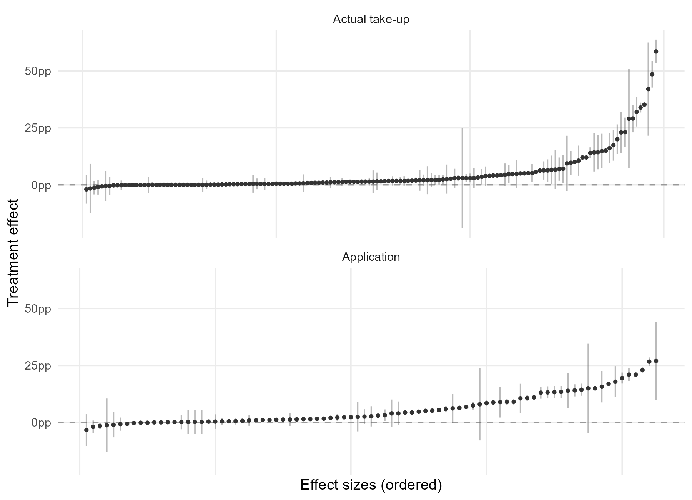
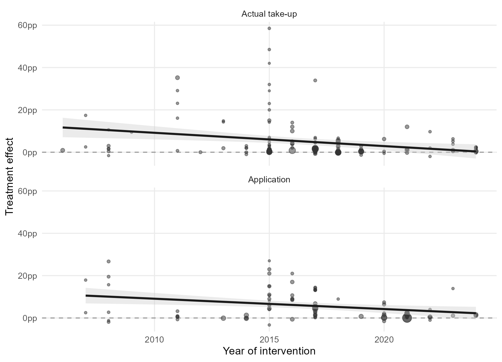
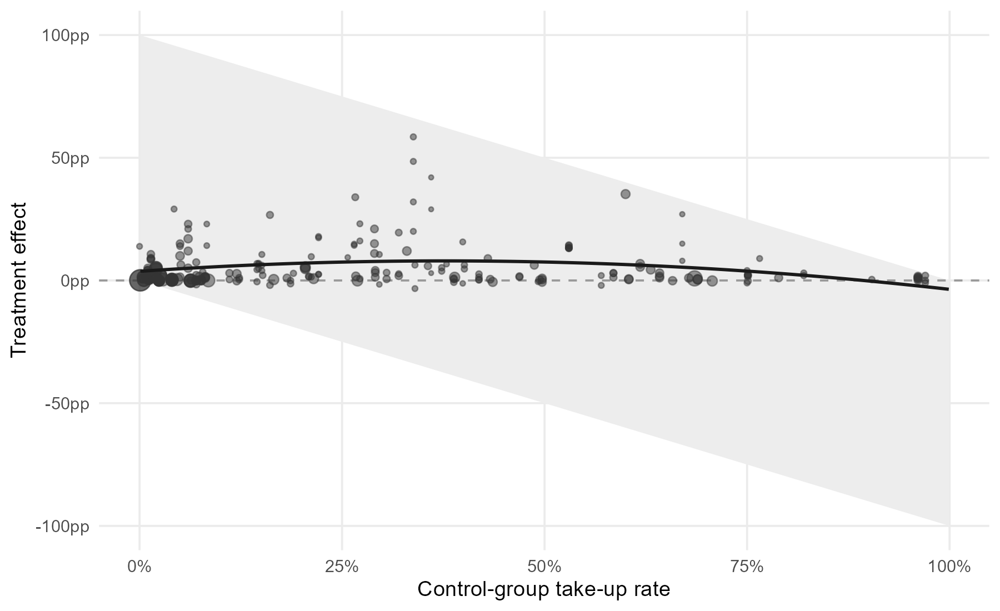

<!-- #CLAUDE: page drafted by Claude (2026-06-10); review prose before publishing -->

This page updates the main results of [*Increasing take-up of social benefits: a meta-analysis of field experiments*](https://doi.org/10.1002/pam.70085) (Journal of Policy Analysis and Management) with field experiments published after the paper's search closed, plus eligible studies the search missed. The updated dataset adds 46 effect sizes from 15 new studies, for a total of 233 effect sizes from 66 field experiments. New studies were coded with the same scheme as the paper; the same three-level meta-analytic models are re-estimated on the extended data.

**The paper's conclusions hold.** Interventions still raise take-up on average, application-stage effects are still about twice the size of effects on actual benefit receipt, and reducing compliance demands still beats providing information. Every estimate is somewhat smaller than in the published version, consistent with the decline effect discussed in the paper: the newest evidence comes mostly from large administrative trials with small effects.

| Estimate | Published | Updated |
|---|---|---|
| Overall average effect | 6.7 pp | 6.0 pp |
| Actual take-up | 4.8 pp | 4.4 pp |
| Application | 10.1 pp | 9.2 pp |
| Compliance premium (vs. learning) | +7.6 pp | +5.6 pp |
| Risk ratio, learning demands (actual take-up) | 1.24 | 1.22 |
| Risk ratio, compliance demands (actual take-up) | 1.62 | 1.47 |

## Effects by outcome type

It remains significantly easier to raise application rates than actual take-up rates.

{width=85%}

## Effects by intervention type

Interventions reducing compliance demands (assistance, simplified procedures) still have substantially larger effects than interventions reducing learning demands (information, reminders), at both stages.

{width=90%}

## All effect sizes

Most effect sizes are small and positive, with a long right tail; many precise estimates sit close to zero.

{width=90%}

## Effects over time

The negative association between intervention year and effect size from the paper persists in the extended data.

{width=90%}

## Effects across the control baseline

A new result made possible by the added studies: effect sizes follow an inverted U across the control-group take-up rate, peaking where roughly a third of eligible people already take up the benefit and vanishing near the ceiling. Part of this shape is mechanical (effects are bounded by the distance to 100%), and baselines correlate with program and intervention type, so this is descriptive rather than causal.

{width=90%}

---

*Updated June 2026. Studies added after publication were located and coded with AI assistance (Claude, with verification against each paper's tables); all inclusion decisions and coding notes are documented in the update's replication files. Comments and missed studies are welcome: [kesb@ifs.ku.dk](mailto:kesb@ifs.ku.dk).*
